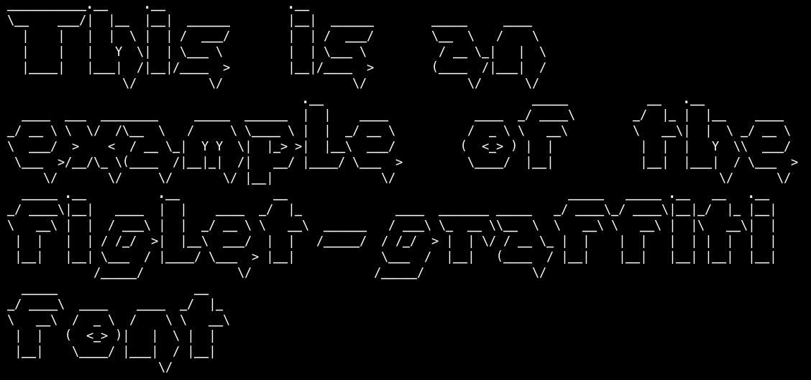

figlet-graffiti
===============

.. versionadded:: 1.3.0

How to use?
-----------

Example::

    from pygamelib.gfx.core import Font
    from pygamelib.base import Text

    my_font = Font("figlet-graffiti")
    my_text = Text("Lorem Ipsum", font=my_font)
    my_text.print_formatted()

What does it look like?
-----------------------

More
----

Please visit the FIGlet project: http://www.figlet.org/

The fonts prefixed by "figlet-" are but a small portion of what's available here.

To easily convert FIGlet fonts to the pygamelib's format you can you the figlet-to-pygamelib script available here: https://github.com/pygamelib/figlet-to-pygamelib

   