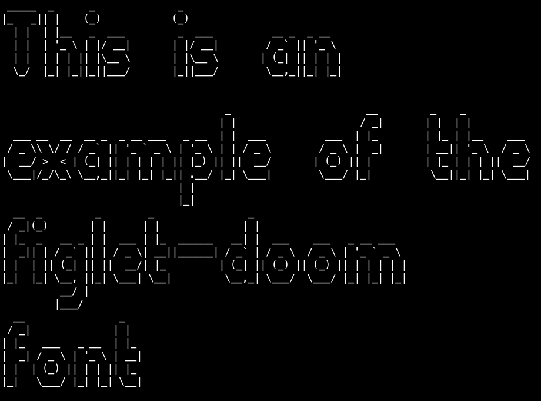

# figlet-doom

This font is automatically generated from the FIGlet font **doom**.

# comment

DOOM by Frans P. de Vries <fpv@xymph.iaf.nl>  18 Jun 1996based on Big by Glenn Chappell 4/93 -- based on Standardfiglet release 2.1 -- 12 Aug 1994Permission is hereby given to modify this font, as long as themodifier's name is placed on a comment line.Explanation of first line:flf2 - "magic number" for file identificationa    - should always be `a', for now$    - the "hardblank" -- prints as a blank, but can't be smushed8    - height of a character6    - height of a character, not including descenders14   - max line length (excluding comment lines) + a fudge factor15   - default smushmode for this font16   - number of comment lines

# credits

FIGlet is available at [http://www.figlet.org/](http://www.figlet.org/)

The fonts are from the [FIGlet font database](http://www.figlet.org/fontdb.cgi).

Each font is the property of its respective author. This is just an adaptation to the
pygamelib font format.
