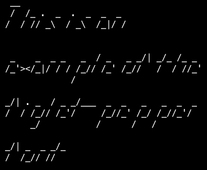

# figlet-pepper

This font is automatically generated from the FIGlet font **pepper**.

# comment

pepper.flf by Dr. Pepper (mcscs1jcwj@dct.ac.uk)Completed and ported to figlet by Juan Car (jc@juguete.quim.ucm.es)version 1.0 -- 20/Jan/94version 1.1 -- 18/Feb/94 -- smushmode 0, thanks to Glenn Chappell (ggc@uiuc.edu)Uses spanish character set with -D option:                                                     _         _[ = a'   \ = e'    ] = i'    { = o'    | = u'    } = n     ~ = N

# credits

FIGlet is available at [http://www.figlet.org/](http://www.figlet.org/)

The fonts are from the [FIGlet font database](http://www.figlet.org/fontdb.cgi).

Each font is the property of its respective author. This is just an adaptation to the
pygamelib font format.
