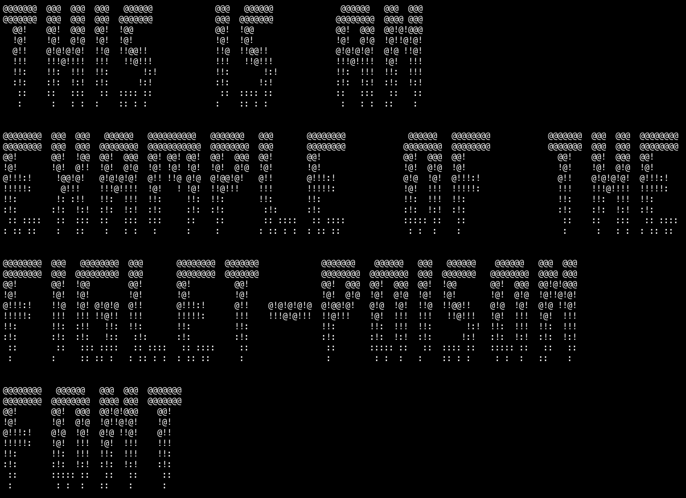

# figlet-poison

This font is automatically generated from the FIGlet font **poison**.

# comment

poison.flf composed into figlet by Vinney Thai <ssfiit@eris.cc.umb.edu>poison font (numbers & puntuation marks) composed by Vinney Thaipoison font (uppercase characters) composed David Issel <dissel@nunic.nu.edu>date: Oct 23, 1994Explanation of first line:flf2 - "magic number" for file identificationa    - should always be `a', for now$    - the "hardblank" -- prints as a blank, but can't be smushed12   - height of a character10   - height of a character, not including descenders20   - max line length (excluding comment lines) + a fudge factor-1   - default smushmode for this font (like "-m 0" on command line)15   - number of comment lines

# credits

FIGlet is available at [http://www.figlet.org/](http://www.figlet.org/)

The fonts are from the [FIGlet font database](http://www.figlet.org/fontdb.cgi).

Each font is the property of its respective author. This is just an adaptation to the
pygamelib font format.
