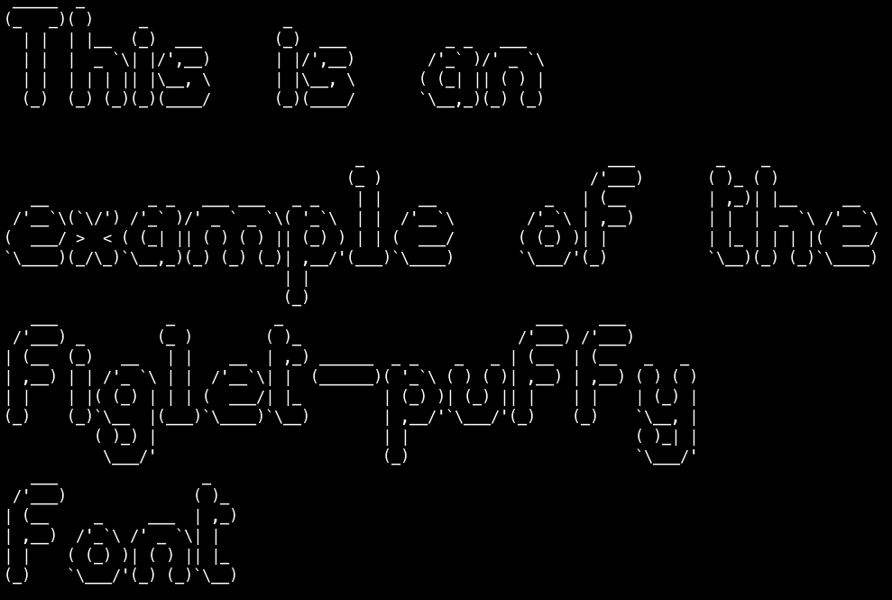

# figlet-puffy

This font is automatically generated from the FIGlet font **puffy**.

# comment

puffy.flf by Juan Car (jc@juguete.quim.ucm.es)Version 1.1 5/Mar/1994

# credits

FIGlet is available at [http://www.figlet.org/](http://www.figlet.org/)

The fonts are from the [FIGlet font database](http://www.figlet.org/fontdb.cgi).

Each font is the property of its respective author. This is just an adaptation to the
pygamelib font format.
