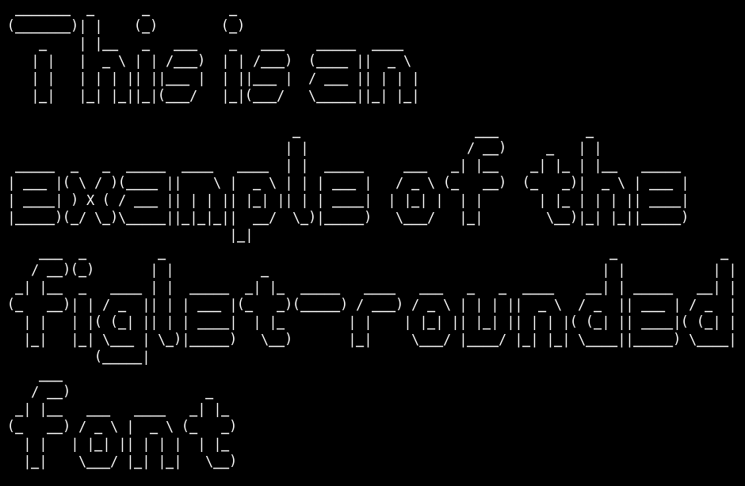

# figlet-rounded

This font is automatically generated from the FIGlet font **rounded**.

# comment

Rounded by Nick Miners N.M.Miners@durham.ac.ukMay 1994

# credits

FIGlet is available at [http://www.figlet.org/](http://www.figlet.org/)

The fonts are from the [FIGlet font database](http://www.figlet.org/fontdb.cgi).

Each font is the property of its respective author. This is just an adaptation to the
pygamelib font format.
