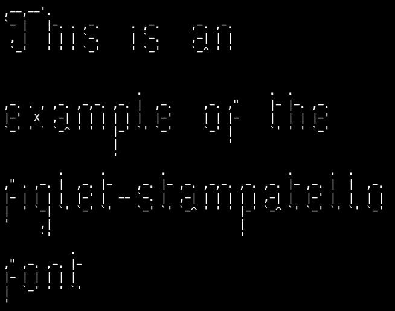

# figlet-stampatello

This font is automatically generated from the FIGlet font **stampatello**.

# comment

Seconda versione del font "stampatello" per figletriveduta e corretta il 29 Febbraio 1996 daMarco Bodrato <bodrato@genio.sns.it> http://www.sns.it/~bodrato/Usa caratteri secondo la tabella iso8859 (+qualche slancio di fantasia)

# credits

FIGlet is available at [http://www.figlet.org/](http://www.figlet.org/)

The fonts are from the [FIGlet font database](http://www.figlet.org/fontdb.cgi).

Each font is the property of its respective author. This is just an adaptation to the
pygamelib font format.
