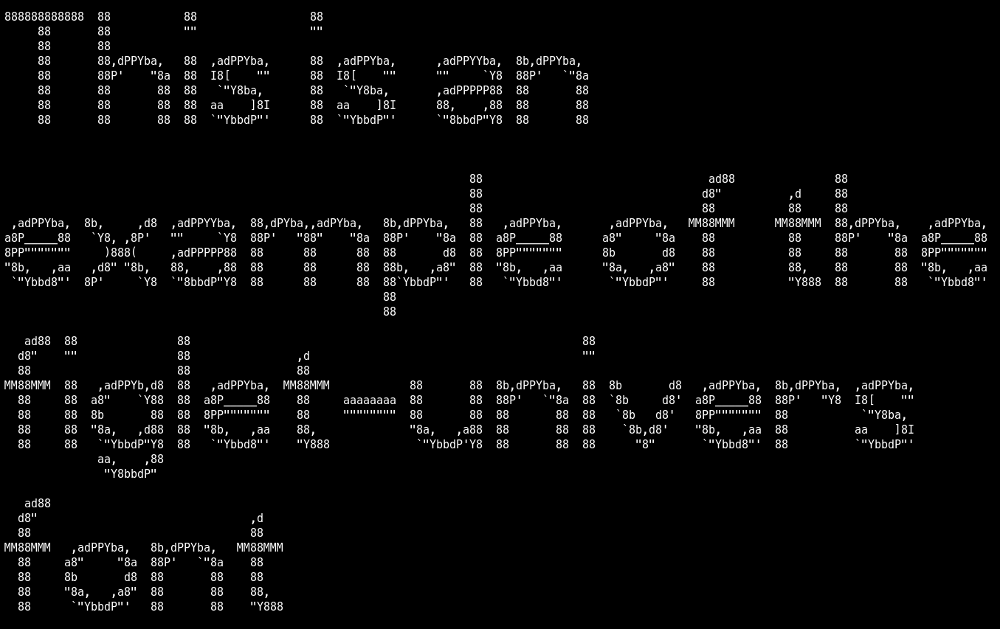

# figlet-univers

This font is automatically generated from the FIGlet font **univers**.

# comment

Univers by Normand Veilleux <nveilleu@emr.ca>figletized by Glenn Chappell <ggc@uiuc.edu> January 12, 1994Date: 5 Mar 1994Explanation of first line:flf2 - "magic number" for file identificationa    - should always be `a', for now$    - the "hardblank" -- prints as a blank, but can't be smushed11   - height of a character9    - height of a character, not including descenders40   - max line length (excluding comment lines) + a fudge factor32   - default smushmode for this font14   - number of comment lines

# credits

FIGlet is available at [http://www.figlet.org/](http://www.figlet.org/)

The fonts are from the [FIGlet font database](http://www.figlet.org/fontdb.cgi).

Each font is the property of its respective author. This is just an adaptation to the
pygamelib font format.
