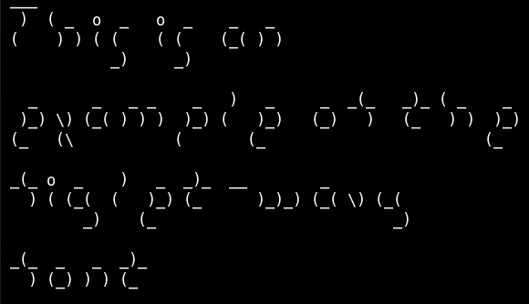

# figlet-wavy

This font is automatically generated from the FIGlet font **wavy**.

# comment

Wavy by Brian Krog 10/05Includes ISO Latin-1figlet release 2.2.2 -- 05 Jul 2005This font is very heavily inspired by the Mini font by Glenn Chappell. Some of the characters are in fact identical to those of the mini font.

# credits

FIGlet is available at [http://www.figlet.org/](http://www.figlet.org/)

The fonts are from the [FIGlet font database](http://www.figlet.org/fontdb.cgi).

Each font is the property of its respective author. This is just an adaptation to the
pygamelib font format.
